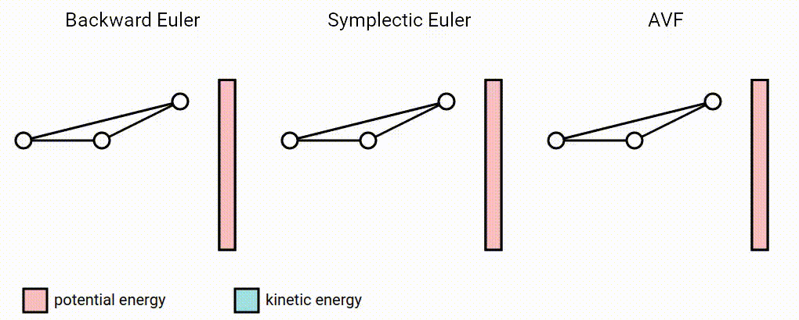
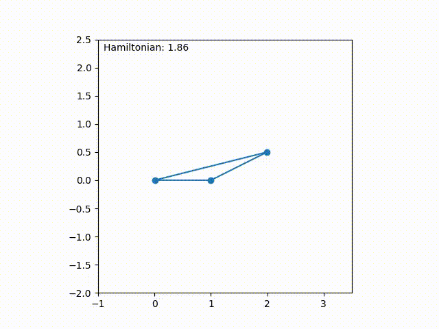
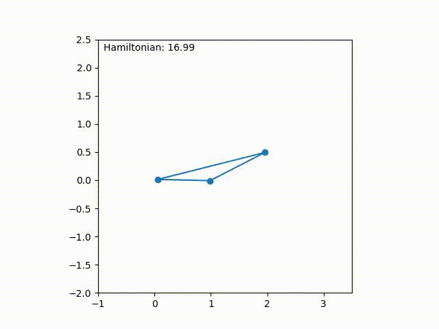
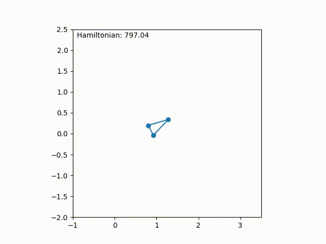

# springs-integration-pytorch

Numerical integration methods for mass-springs systems implemented in PyTorch.

The main purpose of this repository is to show how automatic differentiation can be used to implement different numerical integration methods. Read more [here](https://medium.com/@juniorrojas/numerical-integration-for-physics-based-simulation-via-backpropagation-on-energy-functions-b39c4d3a610).



Tested with Python 3.7 and PyTorch 1.6.0.

## quick start

You can select different simulation parameters via command line arguments. For example, to run backward Euler:

```
python main.py --integrator backward-euler
```



## spring model and stiffness

Two types of springs are available: Hookean springs and Saint Venant–Kirchhoff (StVK) springs (`--springs hookean | stvk`). You can also set the stiffness (`--k`).

| Hookean springs | StVK springs |
| -------------   | ------------- |
| $$E(l) = \frac{k}{2} \|l - l_0\|^2$$ | $$E(l) = \frac{k}{2} \|l^2 - l_0^2\|^2 $$ |

For example, we can run symplectic Euler with Hookean springs:

```
python main.py --springs hookean --integrator symplectic-euler --k 80
```



And with StVK springs:

```
python main.py --springs stvk --integrator symplectic-euler --k 80
```



Symplectic Euler is not very stable. Hamiltonian oscillations can become so large that the simulation eventually explodes.

In contrast, backward Euler does not explode, but introduces artificial damping.

```
python main.py --springs stvk --integrator backward-euler --k 80
```


## energy conservation

The Average Vector Field (AVF) method can preserve energy, which avoids both explosions and artificial damping. This repository contains an implementation of [AVF integration for StVK deformable models](https://medium.com/@juniorrojas/average-vector-field-integration-for-st-venant-kirchhoff-deformable-models-1848787bf1dd) (`--integrator avf4`), which can preserve energy in the particular case of quartic potential energy functions, such as StVK.

We can run the same StVK simulation that was unstable with symplectic Euler, now without explosions.

```
python main.py --springs stvk --integrator avf4 --k 80
```


The energy-preserving property of the AVF method is backed by a mathematical proof, but you might see some small Hamiltonian oscillations under certain circumstances due to the fact that this method requires running an optimization procedure with a numerical tolerance. If you set a tolerance value that is too high (`--optim-tol`), you will see some Hamiltonian oscillations since the required minimization procedure is not solved properly, but the method is still generally stable.

```
python main.py --springs stvk --integrator avf4 --k 80 --optim-tol 0.01
```


You can also improve the accuracy by running `python main.py --dtype double` (the default is `--dtype float`).

## optimizer implementation

Both AVF integration and backward Euler require solving a minimization problem. This repository contains a basic implementation of gradient descent with line search (`sim/integration/optim.py`) to solve this minimization problem, but better methods exist, especially for larger systems. The main purpose of this repository is to show how automatic differentiation can be used for numerical integration. Developing better optimizers that take advantage of automatic differentiation for implicit numerical integration is encouraged as an option to improve the implementation provided in this repository.

## citation

This code was released as supplementary material for the paper [Deep reinforcement learning for 2D soft body locomotion](https://neurips2019creativity.github.io/doc/drlsbl-neurips-2019.pdf) to illustrate implementation details. To cite this in your research, please use the following BibTeX entry:

```bibtex
@conference{rojas2019-drl-sbl,
  title = {Deep reinforcement learning for 2{D} soft body locomotion},
  author = {Junior Rojas and Stelian Coros and Ladislav Kavan},
  booktitle = {NeurIPS Workshop on Machine Learning for Creativity and Design 3.0},
  year = {2019}
}
```

For the [AVF integrator](https://medium.com/@juniorrojas/average-vector-field-integration-for-st-venant-kirchhoff-deformable-models-1848787bf1dd) in particular, please use the following BibTeX entry:

```bibtex
@article{rojas2018-avf-stvk,
  title = {Average Vector Field Integration for St. Venant-Kirchhoff Deformable Models},
  author = {Junior Rojas and Tiantian Liu and Ladislav Kavan},
  journal = {IEEE Transactions on Visualization and Computer Graphics},
  year = {2018}
}
```
